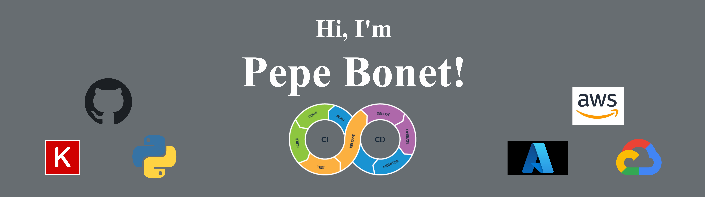

### Hi there 👋

I am Pepe, a fourth year Ph.D. student in the field of computational biology. In short, I build machine learning models that can better solve biological problems. Currently working on how to develop my tech skills and building a company to give value to other companies through AI and ML. 

Do you want to know more about me? [pepesjourney.com](https://www.pepesjourney.com/)

## :pencil: Latest blog Posts

- [8 Rules for a PhD](https://www.pepesjourney.com/post/8-rules-for-a-phd)
- [Should I start a PhD? Tips and challenges](https://www.pepesjourney.com/post/should-i-start-a-phd-tips-and-challenges)
- [What to do after the PhD? (Chapter 1)](https://www.pepesjourney.com/post/what-to-do-after-the-phd)
- [Pros and cons of Academia (As a PhD)](https://www.pepesjourney.com/post/pros-and-cons-of-academia-as-a-phd)

## :pushpin: Pinned Repositories 

 

## :chart_with_upwards_trend: GitHub Stats 

<!--
**pepebonet/pepebonet** is a ✨ _special_ ✨ repository because its `README.md` (this file) appears on your GitHub profile.

Here are some ideas to get you started:

- 🔭 I’m currently working on ...
- 🌱 I’m currently learning ...
- 👯 I’m looking to collaborate on ...
- 🤔 I’m looking for help with ...
- 💬 Ask me about ...
- 📫 How to reach me: ...
- 😄 Pronouns: ...
- ⚡ Fun fact: ...
-->
